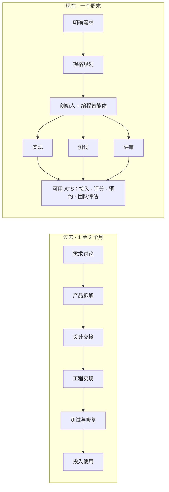
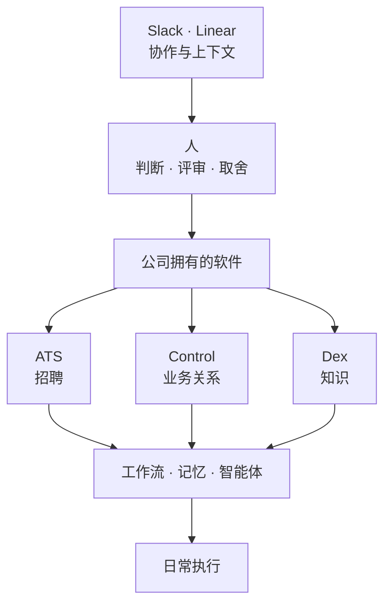
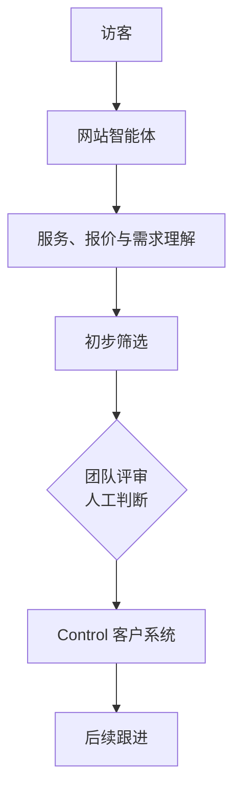
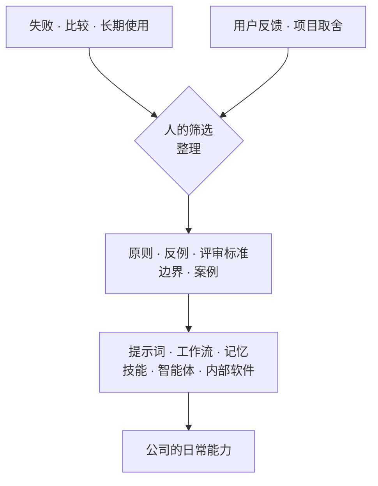

我们决定，不再买 SaaS 了。

这句话当然不完全准确。

我们仍然在为很多软件付费，也不会为了省几十美元订阅费，重新开发支付、财务、云服务和各种成熟的基础设施。

软件写出来以后要维护，内部工具一样会产生技术债。为了满足一点个人偏好就重造所有轮子，通常不是什么 AI 原生，只是低估了长期成本。

但过去几个月，我们确实越来越少继续寻找那个「最接近需求的工具」。

**有些东西找不到，我们就直接做了。**

这件事最早并不是从公司开始的。

<PhotoStack>
  <PhotoStackFrames>

  </PhotoStackFrames>
  <PhotoStackCaption>Jensen 出生后的日常。宝宝助手就从这些需要高频、单手完成的小事里长了出来。</PhotoStackCaption>
</PhotoStack>

第二个宝宝出生以后，我想找一款记录尿布、亲喂和瓶喂的应用。市面上的选择不少，我几乎把同类产品都下载了一遍。但真正每天高频使用以后，总会碰到一些让我不舒服的地方。

有的功能太多，首页像一张控制台；有的记录路径太深，单手抱着宝宝时很难操作；有的看起来可爱，真正使用却不够快；还有一些产品不断叠加新功能，最后连最基础的记录都变得费劲。

我试过的大部分国内应用都带着不少广告，甚至还有国内应用的「传统艺能」：开屏广告。国外的选择通常干净一些，但视觉设计又没到让我满意的程度。两边各有各的问题，始终挠不到我的痒处。

**我没有找到一款符合自己要求的，于是做了一个。**

AI 把业务代码、测试和原型推进得很快。真正花时间的，是把一个「可以运行」的版本，慢慢变成我愿意每天使用的产品。

这件事做了两个月。

当时我没有把它理解成某种趋势。那只是一个很私人的需求：既然找不到，我又有能力做，就为自己的家人做一个。

后来，同样的事情开始在公司里发生。

## 过去不值得做的软件，现在值得了

佐玩同时在中国和世界各地招聘。

我们试过不少招聘管理系统（ATS）。市面上的产品演示起来都很完整，但放进自己的招聘流程以后，总有一些地方需要绕。

候选人的邮件怎样自动进入招聘流程，不同地区和时区怎样预约面试，AI 评分怎样对应不同岗位，面试结束后团队成员如何独立打分，再决定是否继续推进。

每个产品都能解决一部分，却没有一个真正按照我们的工作方式长出来。

过去，我大概会接受这种不合身。

自建一套 ATS，需要产品、设计和工程共同投入，至少一个月，可能两个月。内部工具很难和客户项目、公司产品争资源，最后通常还是买一个差不多能用的 SaaS，再让团队手动补上剩下的缝。

**这次，我们直接做了。**

一个周末，<InlineProductName product="Codex" />、<InlineProductName product="Claude Code" /> 和我把整条流程跑了起来：邮件自动接入、按岗位标准整理和评分、面试自动预约，以及面试后的团队评估和推进决策。

它不是一个放在截图里的原型。它已经在真正管理我们的候选人，最终判断仍然由团队来做，而且运行得不错。

**→ 真正改变的，不只是开发速度，而是哪些软件值得进入排期。**

原本根本不会进入排期的内部软件，现在变成了一个周末就可以验证的选择。

过去，「购买还是自建」的讨论通常很简单。

购买软件便宜，自己开发昂贵，所以除非业务足够特殊，否则就应该购买。

AI 没有让维护成本消失，也没有让所有自研都变得合理。但它明显移动了这条边界。开发一套贴合自己工作方式的软件，不再天然等于启动一个漫长、昂贵的项目。

于是我们又做了 **Control**。

它是佐玩自己的客户关系管理系统（CRM），用来管理客户、潜在客户、项目机会和跟进状态。

之后是 **Dex**。

我们越来越觉得 Notion 变得太重。它加入了大量 AI 能力，却不一定更专注于我们重视的东西：干净的文档、知识库、Markdown、项目交接、客户资产，以及让智能体能够稳定读取和使用的内容结构。

所以我们做了自己的文档和知识系统。现在，团队通过 Dex 分享内部文档、项目交接和客户资产，也直接在里面和 AI 智能体讨论想法。

单独看，这些像是几个互不相关的小产品。

- <InlineProductName product="ATS" /> 管理候选人
- <InlineProductName product="Control" /> 记录客户和机会
- <InlineProductName product="Dex" /> 保存文档与知识

但当它们一个接一个出现，我开始意识到，我们不是单纯在重新开发几个 SaaS。

**→ 我们正在把公司的不同部分，放进自己拥有的软件里。**

## 不再把工作方式寄存在别人的软件里

过去，大多数公司购买通用软件，再让自己的工作方式适应软件。

字段不合适，就多加一张表；流程接不上，就安排一个人搬运；权限不够，就找插件；信息散落在几个系统里，再用会议和 Slack 消息把它们临时拼起来。

**SaaS 的成本从来不只是订阅费。**

还包括团队为了使用它，逐渐放弃了多少原本更自然的工作方式。

当然，不是所有东西都应该自建。

支付、税务、合规、云基础设施和成熟的通用能力，应该交给更专业的团队维护。AI 能写出代码，不代表一家设计和软件公司应该顺手重做 Stripe、GitHub 或一套会计系统。

**值得重新考虑的，是另一类软件。**

招聘标准如何被执行，客户机会如何被识别，项目经验如何被保存，什么事情必须经过怎样的评审。这些看起来像软件功能，实际上是公司工作方式的一部分。

过去，我们只能把这些流程寄存在通用产品里。

现在，对我们这样的团队来说，让软件适应自己，第一次成了一个现实的选择。

我们正在翻新的佐玩官网，也会沿着这条路继续走下去。

新网站不会只是一个展示作品和服务的橱窗。

我们计划让访客直接和网站里的 AI 智能体对话，了解佐玩提供什么服务、项目大致处在哪个报价区间，以及双方是否适合继续聊下去。智能体完成初步整理后，把合适的潜在客户同步到 Slack，**交给团队评审**，再记录进 Control，进入后续跟进。

网站接住机会，智能体负责整理，<InlineProductName product="Slack" /> 让人参与判断，Control 保存关系和状态。

**到了这里，软件已经不只是员工手里的工具。它开始参与公司的工作。**

但当开发变便宜以后，新的瓶颈也更明显了。

**→ 难的不再只是把软件写出来，而是决定哪些工作方式值得被写进软件。**

## 代码越来越便宜，判断越来越贵

最近几年，关于 AI 原生人才有一种很流行的判断：

> **学习速度 &gt; 经验。**

**我不完全同意。**

学习速度当然重要。模型、工具和工作流一直在变，只依赖过去的答案，很快就会落后。

但在真正做产品的时候，经验经常决定细节的成败。

一个人可以快速学会 SwiftUI，也可以让智能体写出业务逻辑、单元测试和界面测试，却未必知道一个已经能跑的产品，为什么仍然不够好。

在宝宝助手应用里，尿布记录、亲喂计时和瓶喂记录都是最高频的操作。

最初，我把它们做成大卡片平铺在首页。两列一行，几个工具就占据了大部分屏幕。

后来改成三列，信息密度更高了，但可触区域变窄，也更容易误触。

我又把工具收进快捷菜单。一开始入口放在标签栏右侧，有用户希望放到左边，因为左手操作更方便。但在我当时采用的 SwiftUI 和系统标签栏方案里，无法自由定制到这种程度。要完全满足这个需求，就得自己实现一套标签栏，同时失去很多系统原生能力和液态玻璃效果的好处。

每一个方案都能实现，也都能找到理由。

AI 可以很快把它们分别写出来，却不会替我决定应该接受哪一种代价。

最后，我回到了原生标签栏，把快捷入口放在中间，同时将固定功能改成类似 <InlineProductName product="App Store" /> 的工具集，让不同家庭自己添加或删除需要的功能。

这样既照顾了左右手操作，也保留了原生能力，还避免产品随着功能增加变得越来越臃肿。

回头估算整个开发过程，大约是这样：

<TimeAllocationChart />

这些判断不是因为我记住了某条设计公式。

它们来自我用过很多应用，主动下载同类产品比较，也长期关注那些小而美的团队和优秀设计工程师的作品。

**所谓见多识广，不只是看过很多漂亮截图。**

是知道一个细节什么时候真的会让人觉得顺手，也记得自己使用某些产品时，那一下被认真对待的感觉。

我也希望自己的产品能给别人同样的感受。

## 让系统继承经验，把决定留给人

**所以，经验没有因为 AI 出现而贬值。**

它只是开始改变自己的载体。

过去，经验主要存在于某个人的脑子里。一个做过十年产品的人知道哪些问题值得警惕，哪些看起来聪明的方案最后会成为负担，但团队很难完整继承这些判断。

现在，一部分经验可以被筛选和整理，变成提示词、工作流、记忆、评审标准、案例、反例，甚至成为智能体可以调用的技能。

后来的人不一定需要重新花十年，重复踩完同样的坑。

但这里有一个绕不过去的前提。

**必须先有人知道，什么经验值得被保存。**

没有足够深的实践，很难分辨一条真正的原则和一次偶然成功，也很难知道哪些细节是产品成立的原因，哪些只是个人习惯。

AI 可以缩短经验被传播的时间，却不能让经验凭空出现。

目前，我最不愿意完全交给智能体的，还是视觉设计。

不是因为 AI 做不出一个看起来不错的画面。它已经可以快速生成大量方案，也能不断接近指定的风格。

问题在于，视觉最容易暴露系统的边界。

**一个方案能运行、能通过测试，甚至数据表现不差，仍然不代表它值得被做成那个样子。**

好看、好用、耐用，有一点恰到好处的惊喜，动效存在却不会抢走注意力。这些要求可以被描述，也可以逐渐沉淀进设计系统、案例和评审标准里，但很难被完整写成公式。

AI 可以不断靠近我们想要的模样。

**最终仍然要有人说，这就是我们愿意交付的东西，或者这还不是。**

数据可以帮助判断一个产品是否有效，却不能替公司决定应该追求什么。代码可以验证能不能运行，却不能决定什么值得被建造。

重复劳动可以交给智能体，经验可以留进系统，人的注意力则回到判断、品味，以及那些不能只靠完成度衡量的决定。

所以，我现在越来越觉得，AI 原生并不是一套新的人才标签。

它首先是一种重新分配。

- **经验** 从个人记忆迁移到可以运行的系统里
- **重复劳动** 从人迁移到智能体
- **人的时间** 回到仍然需要选择和责任的地方

我们仍然会购买大量 SaaS。成熟的通用能力，本来就应该交给最适合维护它们的人。

但那些真正承载佐玩如何招聘、如何理解客户、如何保存知识，以及如何作出取舍的部分，我们不想再完全寄存在别人的软件里。

我们决定不再买的，并不是 SaaS。

**是那些要求我们先放弃自己的工作方式，才能勉强使用的软件。**
